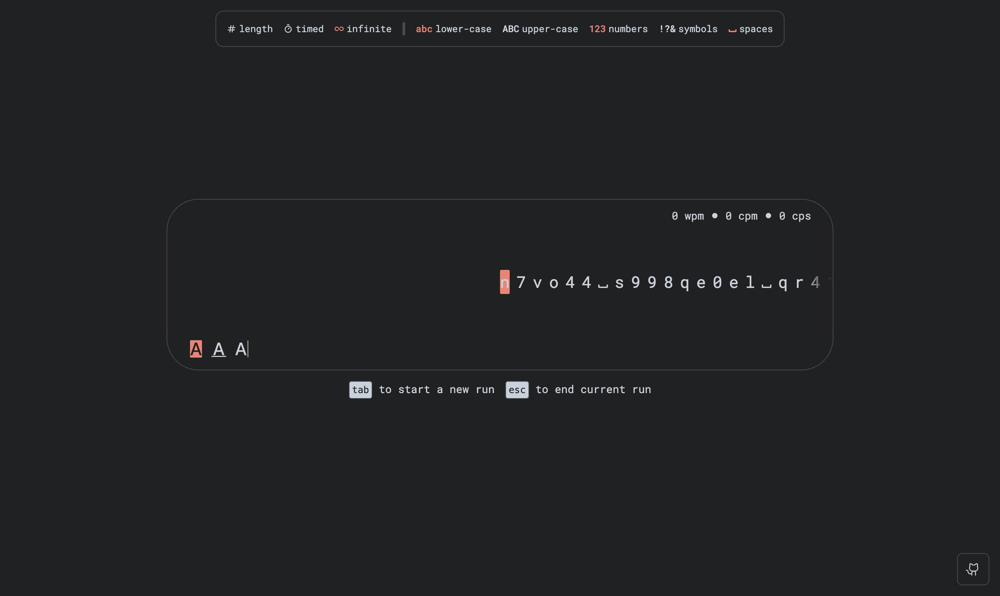

# 
 Char typer

Yet another app to train your typing skills, with focus on typing characters instead of words.

## Used to create
- [pnpm](https://pnpm.io)
- [biome](https://biomejs.dev)
- [rsbuild](https://rsbuild.dev)
- [typescript](https://www.typescriptlang.org)
- [react](https://react.dev)
- [tailwindcss](https://tailwindcss.com)
- [zustand](https://github.com/pmndrs/zustand)
- [mutative](https://github.com/unadlib/mutative)

### TODO
- [ ] Option to change font family and size
- [ ] Theme editor
- [ ] Option to hide ui elements
- [ ] Option specifiy custom characters
- [ ] Mobile mode

### Inspired by
- [monkeytype](https://monkeytype.com/)
- [keybr](https://www.keybr.com/)
